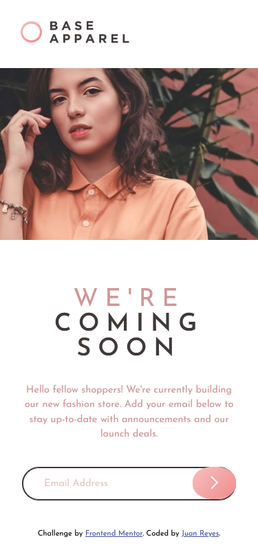

# Frontend Mentor - Base Apparel coming soon page


## The challenge

Want some support on the challenge? [Join our community](https://www.frontendmentor.io/community) and ask questions in the **#help** channel.

## Deploying your project

As mentioned above, there are many ways to host your project for free. Our recommended hosts are:

- [GitHub Pages](https://pages.github.com/)
- [Vercel](https://vercel.com/)
- [Netlify](https://www.netlify.com/)

You can host your site using one of these solutions or any of our other trusted providers. [Read more about our recommended and trusted hosts](https://medium.com/frontend-mentor/frontend-mentor-trusted-hosting-providers-bf000dfebe).

## Got feedback for us?

We love receiving feedback! We're always looking to improve our challenges and our platform. So if you have anything you'd like to mention, please email hi[at]frontendmentor[dot]io.

# Frontend Mentor - Base Apparel coming soon page solution

This is a solution to the [Base Apparel coming soon page challenge on Frontend Mentor](https://www.frontendmentor.io/challenges/base-apparel-coming-soon-page-5d46b47f8db8a7063f9331a0). Frontend Mentor challenges help you improve your coding skills by building realistic projects. 

## Table of contents

- [Overview](#overview)
  - [The challenge](#the-challenge)
  - [Screenshot](#screenshot)
  - [Links](#links)
- [My process](#my-process)
  - [Built with](#built-with)
  - [What I learned](#what-i-learned)
  - [Continued development](#continued-development)
  - [Useful resources](#useful-resources)
- [Author](#author)


## Overview
  - Este es un proyecto genial para comprobar si el tema de validación de formularios lo tienes claro.
  - Aparte del diseño, que sugiere diferentes estrategias de diseño.
### The challenge

  - Creo que el reto está logrado, por que he conseguido (aunque me costó bastante) realizar más que una digna validación. He de reconocer que el diseño me costó más de lo habitual, para lo aparentemente sencillo que parecía en un principio.

### Screenshot




### Links

- Solution URL: [URL-solucion](https://github.com/juan-mentor/base-apparel-coming-soon-master.git)
- Live Site URL: [lugar en vivo](https://juan-mentor.github.io/base-apparel-coming-soon-master/)

## My process
  - En esta ocasión el proceso fué construir primero el diseño a nivel de móvil, y después el diseño de escritorio. Pero al hacerlo así, me costó reescribir el código, incluso la estructura de HTML, por que la transición de un diseño de 375px a 1440px es a veces poco intuitiva y algo más compleja. Sobre todo porque hay que tener en cuenta el tamaño de las fuentes, los padings (que varían en proporción a los espacios existentes), los márgenes.

### Built with

- Semantic HTML5 markup
- CSS custom properties
- Flexbox
- Mobile-first workflow

- Me di cuenta que para valorar  el contenido del input tipo email, debía poner un addEventListener con el evento Input (también lo probé con change).

```html
<input type = "email">
```
- Necesité del parámetro event para que fuera dinámico.

```js
elementInput.addEventListener('input', (e) => {
  paragraph = e.target.value;
})
```
- Podría haber utilizado las expresiones regulares para comprobar si el email era correcto, pero no las domino, ni me siento cómodo utilizándolas(aunque soy consciente de que me facilitan mucho el trabajo de validación). Por el contrario, utilicé el método indexOf para ver si tenía el @ y el .com. Así como el valor falso de 0, para verificar si el campo del email estaba vacío.

```css
function checkEmail() {
    if (paragraph.indexOf('@') !== -1 && paragraph.indexOf('.') !== -1 && paragraph.indexOf('com') && paragraph.length) {
  }
}
```

### Continued development

- Me gustaría aprender más de como utilizar las expresiones regulares.

### Useful resources

- [validar formularios MDN](https://developer.mozilla.org/es/docs/Learn/Forms/Form_validation) - 

## Author

- Frontend Mentor - [@juan-mentor](https://www.frontendmentor.io/profile/juan-mentor)